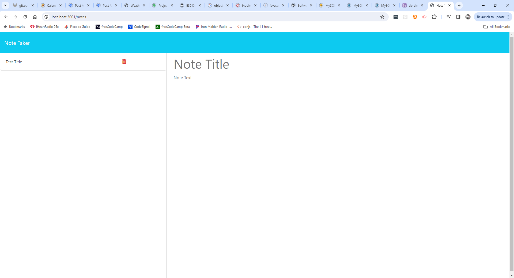

  # Logo Maker

  ## Description
  UofM Challenge #11 - Note Taker - Given the front end code for a note taking app, write the back-end with Express

 

  ## Table of Contents
  - [Installation](#installation)
  - [Usage](#usage)
  - [Credits](#credits)
  - [License](#license)
  - [Badges](#badges)
  - [How to Contriubute](#contribute)
  - [Tests](#tests)
  - [Contact Info](#contact)

  
  ## Installation
  Clone the repo to your local machine.
  Run "npm i"

  
  ## Usage
  "node server" to start the server.

  
  ## License
  [License: MIT](https://opensource.org/licenses/MIT 'MIT License')

  
  ## Badges
  

  
  ## Contact Info
  GitHub: [dbrainz](https://github.com/dbrainz 'GitHub profile')  Email: [darren.brain@gmail.com](mailto:darren.brain@gmail.com 'Email address')
